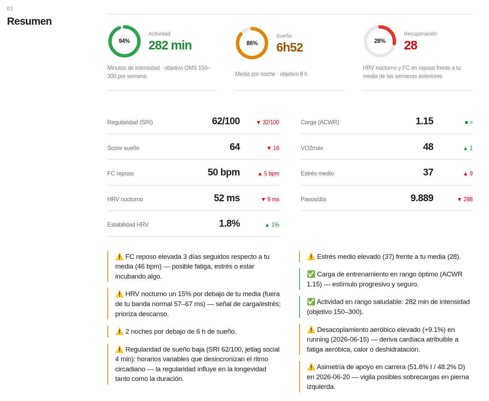
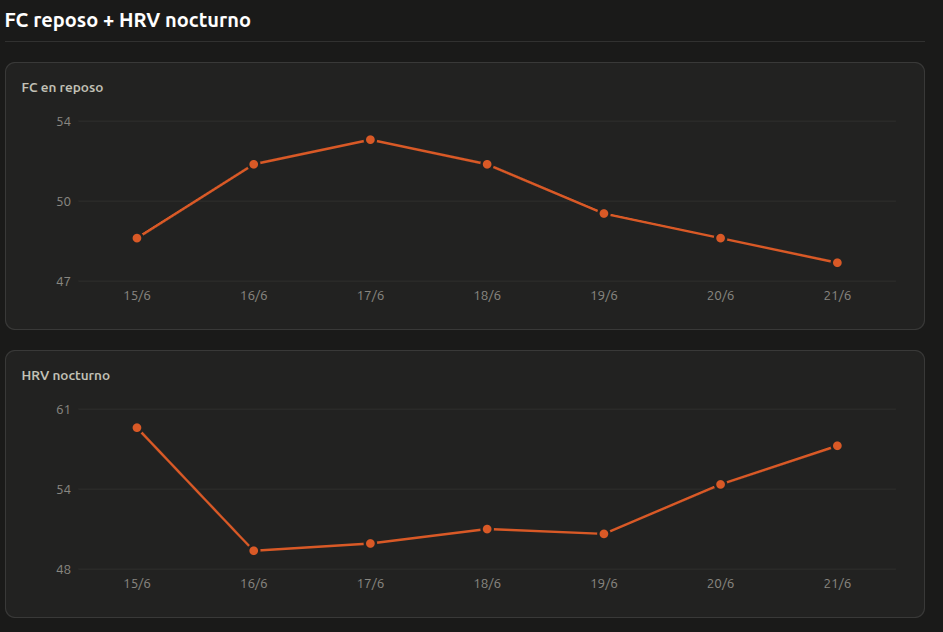

<picture>
  <source media="(prefers-color-scheme: dark)" srcset="assets/logo/logo-white.png">
  
</picture>

# BioDelta

_**English** · [Español](README.es.md)_

[](https://github.com/jaimegk/biodelta/actions/workflows/tests.yml)
[](LICENSE)

Turn your [Garmin Connect](https://connect.garmin.com) data into a weekly health report and
an interactive dashboard that tell you **what deserves attention** — not just what happened.

Every metric is compared against **your own average over the previous ~4 weeks** (not against
population norms), and that comparison drives automatic **signals and diagnostics**: a health
traffic light, resting heart rate up for several days in a row, HRV out of your normal band,
short nights, irregular bedtimes and high stress.

Everything runs 100% locally. Your credentials and your health data never leave your machine.

> The report is available in English and Spanish (`--lang en|es`, or the flag switcher in the
> dashboard). The code comments are in Spanish; the docs and this README are in English.

<picture>
  <source media="(prefers-color-scheme: dark)" srcset="docs/screenshot-dark.png">
  
</picture>

**[▶ See a full interactive example report](https://jaimegk.github.io/biodelta/)** ·
[Markdown version](docs/ejemplo_garmin_log.md)

## 🚀 1-Click Quickstart

You can use BioDelta without touching the terminal or configuring environments:

- **Linux / macOS:** Double-click `iniciar.command` or run:
  ```bash
  ./iniciar.sh
  ```
- **Windows:** Double-click `iniciar.bat`.

The launcher sets up the virtual environment on first run and opens BioDelta in your browser
at `http://localhost:8000`.

### Try it in 30 seconds (no Garmin account needed)

```bash
git clone https://github.com/jaimegk/biodelta.git
cd biodelta
./iniciar.sh
```

When the app opens, click **✨ Demo** to explore a full six-week report built from synthetic
data, with every signal active. No account, no credentials, no network.

## What makes it different

**Health traffic light and plain-language diagnosis.** The report opens with an executive
summary (🟢 Optimal / 🟡 Attention needed / 🔴 Recovery needed) and three sentences in plain
language: sleep duration and regularity, autonomic recovery and stress, and what to do today.

**Local web dashboard and time travel.** Jump between weeks (`◀` / `▶`), drag and drop a
`garmin_data.db` file, or sync straight from Garmin Connect with **two-factor authentication
(2FA/MFA)** support. The server binds to `127.0.0.1` and only accepts requests from itself.

**Interactive metric glossary.** A `📖 Glossary` button with a clear, evidence-based
definition of every metric (SRI, ACWR, RMSSD, aerobic decoupling, VO2max…).

**Synchronized charts.** Hover over any day to read its exact values and highlight that same
day across every chart of the week at once.

**Your baseline, not the population's.** "49 bpm" means nothing on its own; "49 bpm when
yours is 46, three days running" does.

**Both charts tell the same story.** When resting heart rate climbs, HRV drops — the report
shows them side by side instead of leaving you to cross-reference tables.

<picture>
  <source media="(prefers-color-scheme: dark)" srcset="docs/screenshot-charts-dark.png">
  
</picture>

**The metrics that actually matter.** VO2max is the single strongest predictor of all-cause
mortality, and a mid-range watch covers 7 of the ~14 best-evidenced risk factors. The full
write-up (in Spanish) is in
[`docs/mortalidad_prematura_y_forerunner165.md`](docs/mortalidad_prematura_y_forerunner165.md).

**Two formats, two readers.** The `.md` is meant to be handed to an AI; the `.html` is meant
to be read by you — a single self-contained file, no network, with a light/dark switch.

```
garmin extract (incremental)  →  garmin_data.db (SQLite)  →  output/garmin_log_<start>_<end>.md
                                                          └→  output/garmin_log_<start>_<end>.html
```

## Requirements

- Python 3.10+ (tested on 3.12)
- A Garmin Connect account (not needed for `--demo`)

## Setup

`garmin auth` reads `GARMIN_EMAIL` and `GARMIN_PASSWORD` from the environment; if they are
missing it prompts for them. If you would rather keep them in a file:

```bash
cp .env.example .env          # then fill in your credentials
set -a; source .env; set +a   # export them into this shell
.venv/bin/garmin auth         # may ask for two-factor verification
```

This creates the session that later syncs reuse. `.env` is in `.gitignore`, and the tokens are
stored under `~/.garminconnect/`, outside the repository.

## Usage

```bash
# Previous ISO week (Mon–Sun) + sync with Garmin
python generate_report.py

# Same week, no sync (database already up to date)
python generate_report.py --no-sync

# From a date up to today
python generate_report.py --start-date 2026-05-28

# Explicit range: for periods longer than a week the summary breaks down into ISO
# weeks and shows the week-by-week evolution and trend (last week vs the rest)
python generate_report.py --start-date 2026-05-01 --end-date 2026-05-31

# Example report built from synthetic data
python generate_report.py --demo

# Report in Spanish (English is the default)
python generate_report.py --lang es

# Inspect the database schema (tables and columns)
python generate_report.py --inspect-schema
```

Or run the local dashboard, which does all of the above from the browser:

```bash
python app.py                 # http://localhost:8000, opens the browser
python app.py --port 9000 --no-browser
```

### The HTML version

Every run also writes an `.html` next to the `.md`: formatted tables, the card header, and
**charts for sleep stages, resting heart rate, HRV, stress over Body Battery, and daily steps**.

It opens with a double click — a single self-contained file with no external resources (the
only JavaScript is the theme switch, the glossary and the chart tooltips), so it works offline
and travels well to a phone. It follows the system light/dark
theme, and hovering a bar or a point shows its exact value.

## What's in the report

| Section | Metrics |
|---------|---------|
| **Summary** | Automatic signals first, then every metric against your ~4-week average. Reports spanning **more than one week** switch to a **week-by-week evolution table** with trends |
| **Sleep** | Duration, stages (deep / REM / light), score, **bedtime and wake time + regularity**, time awake, **naps**, awakenings, stress during sleep, and Body Battery recovered |
| **Resting HR + HRV** | Resting heart rate, overnight HRV (approx. RMSSD) and HRV status |
| **Respiration & SpO2** | Overnight SpO2 (average / lowest) and respiration rate — indicative, for screening |
| **Stress & Body Battery** | Daily average stress, Body Battery high and low |
| **Activity** | Sessions (type and duration), average HR, **intensity minutes**, Body Battery delta, steps and floors |
| **Session detail** | Per session: distance, pace, average/max HR, HR zone split, aerobic/anaerobic effect, kcal, and sport-specific metrics (cadence, stride, GCT, power, elevation gain; SWOLF and lengths for swimming) |
| **Laps** | Per session: time, distance, pace, min/avg/max HR, cadence and elevation (up / down) for each lap |
| **Fitness** | VO2max and predicted race times |

Sleep is attributed to the day you went to bed (not the day you woke up), and invalid
stress/Body Battery readings (`value < 0`) are discarded.

> **On VO2max:** the Forerunner 165 only estimates it from **outdoor runs or walks with GPS**
> (or cycling with a power meter). Indoor, treadmill and swimming sessions produce no estimate.

## Tests

```bash
python test_report.py     # no framework, just asserts
```

They cover the formatters, the sleep-regularity maths, the signal rules, the Markdown
converter and the SVG charts. The end-to-end test builds the demo database and runs the whole
pipeline, which is what exercises the SQL queries.

## Privacy

This repository contains **no personal data**. The following is generated locally and excluded
by `.gitignore`:

- `.env` — your credentials
- `garmin_data.db` — the SQLite database with your history
- `garmin_files/` — `.fit` and JSON files downloaded from Garmin
- `output/` — generated reports (`.md` and `.html`)

The example report published under `docs/` is generated with `--demo`: synthetic data that
belongs to no real person.

## Disclaimer

This is a personal wellness project, not a medical device. Wrist-optical metrics are
indicative, and the associations cited are population-level: they do not diagnose anything in
any individual.

Development notes: [CONTRIBUTING.md](CONTRIBUTING.md) — how to regenerate the
example, and the Garmin data-model gotchas worth knowing before changing a query.

## License

[MIT](LICENSE)
